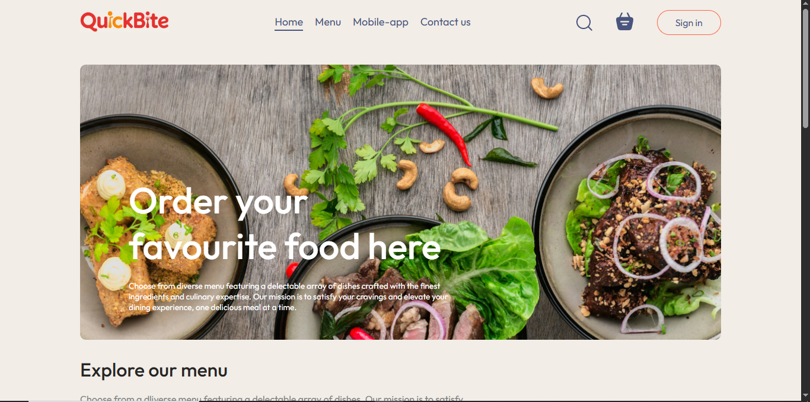
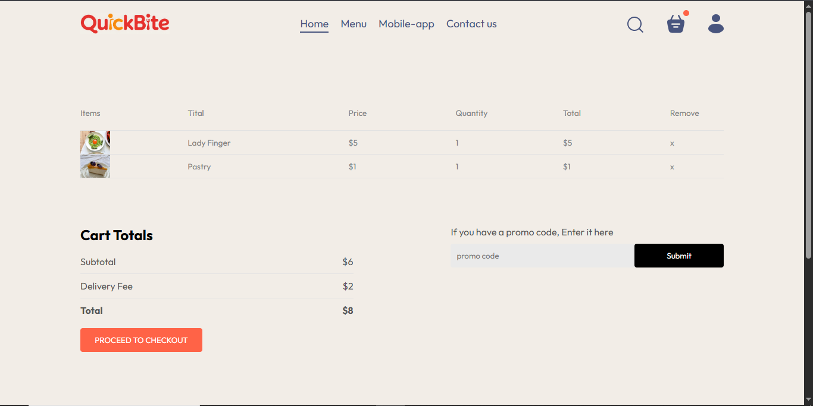
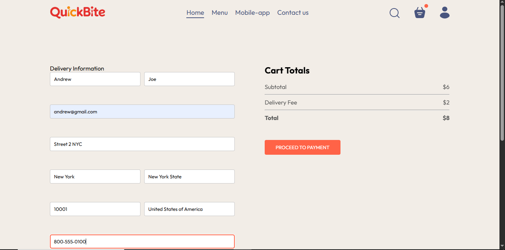
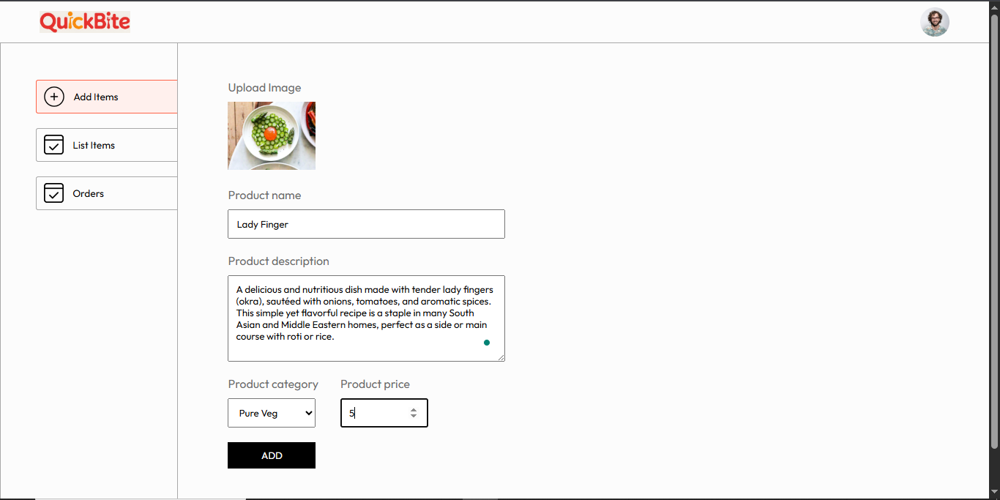

# QuickBite

QuickBite is a food delivery web application where users can browse food categories, add items to their cart, provide details, and place orders via a payment system. Admin users have full control over food items, order management, and can view user orders.

## Table of Contents
- [Features](#features)
- [Tech Stack](#tech-stack)
- [Installation](#installation)
  - [Backend Setup](#backend-setup)
  - [Frontend Setup](#frontend-setup)
  - [Admin Setup](#admin-setup)
- [API Endpoints](#api-endpoints)
  - [User Endpoints](#user-endpoints)
  - [Food Endpoints](#food-endpoints)
  - [Cart Endpoints](#cart-endpoints)
  - [Order Endpoints](#order-endpoints)
- [Usage](#usage)
- [Screenshots](#screenshots)
  

## Features

- **User Authentication**: Users can register and log in using email and password.
- **Food Menu**: Users can browse and view food items categorized for easy navigation.
- **Cart Management**: Users can add, view, and remove items from the cart.
- **Order Placement**: Users can place orders by providing delivery details and making payments through Stripe.
- **Admin Dashboard**: Admins can add, remove, and manage food items and view orders.
- **Order Verification**: Admin can verify orders placed by users.

## Tech Stack

- **Frontend**: React.js, Axios, React Router DOM
- **Backend**: Node.js, Express.js, JWT, Multer, bcrypt, Stripe API
- **Database**: MongoDB
- **Libraries/Tools**: 
  - **Frontend**: React, Axios for API calls
  - **Backend**: JWT for authentication, Multer for file uploads, Stripe for payment processing

## Installation

### Backend Setup

1. Clone the repository:
   ```bash
   git clone https://github.com/your-username/QuickBite.git
   cd QuickBite
   ```
2. Install backend dependencies:
   ```bash
   cd server
   npm install
   ```
3. Set up environment variables in a `.env` file:
   - `PORT`: The server port
   - `JWT_SECRET`: Secret key for JWT authentication
   - `STRIPE_SECRET_KEY`: Your Stripe secret key
   - `MONGO_URI`: MongoDB connection URI
4. Start the backend server:
   ```bash
   npm start
   ```

### Frontend Setup

1. Navigate to the frontend directory:
   ```bash
   cd client
   ```
2. Install frontend dependencies:
   ```bash
   npm install
   ```
3. Update API URLs in `src/api.js` to match your backend.
4. Start the frontend server:
   ```bash
   npm run dev
   ```

### Admin Setup

1. Navigate to the admin directory:
   ```bash
   cd admin
   ```
2. Install admin dependencies:
   ```bash
   npm install
   ```
3. Update API URLs in `src/api.js` for the backend calls.
4. Start the admin panel:
   ```bash
   npm run dev
   ```

## API Endpoints

### User Endpoints:
- `POST /api/user/register`: Register a new user.
- `POST /api/user/login`: Login an existing user.

### Food Endpoints:
- `POST /api/food/add`: Admins can add new food items.
- `GET /api/food/list`: Get a list of all food items.
- `POST /api/food/remove`: Admins can remove food items.

### Cart Endpoints:
- `POST /api/cart/add`: Add an item to the cart.
- `POST /api/cart/remove`: Remove an item from the cart.
- `POST /api/cart/get`: Get the user's cart.

### Order Endpoints:
- `POST /api/order/place`: Place an order after payment and providing details.
- `POST /api/order/verify`: Verify the order after payment.
- `POST /api/order/userorders`: Get the list of orders for the authenticated user.
- `GET /api/order/list`: Admin can get a list of all orders.

## Usage

1. Start the backend, frontend, and admin servers by following the installation steps above.
2. As an admin:
   - Log in to the admin panel.
   - Add food items via the admin panel (use `POST /api/food/add`).
   - View the orders placed by users via the admin dashboard (`GET /api/order/list`).
3. As a user:
   - Register and log in to the application.
   - Browse food items and add them to the cart.
   - Proceed to place an order after filling in your details and making the payment.
   - After payment, verify your order through the order verification endpoint.
4. Test the functionality of the cart, order placement, and order management system.
5. Admin can monitor orders and manage the food menu in real-time.

## <a name="screenshots"></a>📸 Screenshots









Admin



